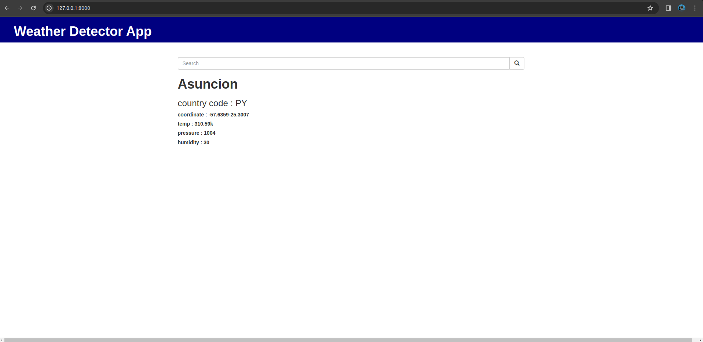

# Building A Weather Application With Django

This project aims to create a weather application using Django, a high-level Python web framework, to consult an API and display weather information to users. By integrating an external API, this application provides real-time weather updates for specified locations.



## Table of Contents
1. [Introduction](#introduction)
2. [Features](#features)
3. [Installation](#installation)
4. [Usage](#usage)
5. [Contributing](#contributing)
6. [Credits](#credits)
7. [License](#license)

## Introduction

Weather applications have become indispensable tools in today's world, offering users accurate weather forecasts for planning their activities. This project leverages Django's powerful capabilities to build a robust and user-friendly weather application. By consulting an API, users can obtain up-to-date weather information for any desired location.

## Features

- **User-friendly Interface**: The application provides an intuitive interface for users to input their location and retrieve weather forecasts easily.
  
- **Real-time Data**: By integrating with a weather API, the application fetches real-time weather data, ensuring accuracy and reliability.

## Installation

To run this application locally, follow these steps:

1. Clone the repository:
   ```bash
   git clone https://github.com/luisrpavanelli/weather-application-py-django.git
   ```

2. Navigate to the project directory:
   ```bash
   cd weather-application-py-django
   ```

3. Install the required dependencies:
   ```bash
   pip install -r requirements.txt
   ```

4. Obtain API credentials from the [Open Weather Map API](http://api.openweathermap.org) and configure them in the application settings.

    urllib: (http://api.openweathermap.org/data/2.5/weather?q='+city+'&appid=cb771e45ac79a4e8e2205c0ce66ff633)

5. Run migrations to set up the database:
   ```bash
   python manage.py migrate
   ```

6. Start the Django development server:
   ```bash
   python manage.py runserver
   ```

7. Access the application at `http://localhost:8000` in your web browser.

## Usage

1. Open the application in your web browser.

2. Enter the desired location for which you want to check the weather.

3. Click on the "Search" button to retrieve weather information for the specified location.

4. View the weather forecast displayed on the screen, including the name of city temperature, humidity, pressure, coordinate, country code.

## Contributing

Contributions are welcome! If you'd like to contribute to this project, feel free to fork the repository and submit a pull request with your changes.

## Credits

- **Developer**: [Luisrpavanelli](https://github.com/luisrpavanelli)
- **Weather API**: [Open Weather Map API](http://api.openweathermap.org)

## License

This project is licensed under the [MIT License](LICENSE).